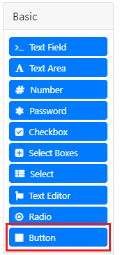
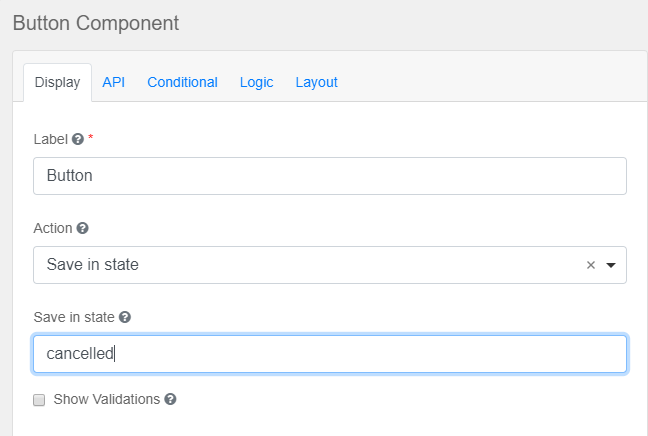
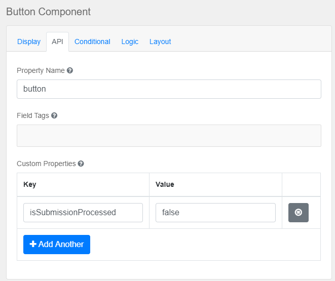

# ART-BPMS-REST

ART-BPMS-REST is a module which provides a simple interface to communicate with [Camunda] and simplifies work with bpm process'
forms through [Form Client] that takes the responsibility for validation, form fields manipulation etc.

Features:
* Simple set of [REST endpoints] to communicate with [Camunda] platform
* Integration with [Form Client]
* Robust data validation using both java validation and form client validation
* Possibility to skip submitted data validation (useful while cancel operation)
* File conversion between different formats, controlled by file converters  
* Files uploading/downloading using file storages
* Bpm resources storing/loading using resource loaders
* Caching
* Default implementation of Message Correlation and Signal services

>Note:
>Given document assumes use of [Formio Client] implementation of [Form Client] interface.

---
* [Architecture Overview](#architecture-overview)
* [Security](#security)
* [Environment Installation](#environment-installation)
    * [Docker](#docker)
    * [Manual](#manual)
        * [Requirements](#requirements)
        * [Installation](#installation)
    * [ART-BPMS-REST environment resources](#art-bpms-rest-environment-resources)
* [Application Download](#application-download)
* [Application Deploy](#application-deploy)
    * [WAR module](#war-module)
    * [EAR module](#ear-module)
* [Usage](#usage)
    * [Work With Forms](#work-with-forms)
        * [Form Creating Notes](#form-creating-notes)
    * [Validation](#validation)
    * [Mapping Submitted Data to Java Classes](#mapping-submitted-data-to-java-classes)
    * [File storage](#file-storage)
    * [Resource Loaders](#resource-loaders)
    * [Bpms-rest SPA example](#bpms-rest-spa-example)
---

## Architecture Overview


## Security

Application REST API is based on JAX-RS with EJB technology. The application specifies that users having the given roles are allowed access to REST API in declarative way. Authentication must be implemented in an application server in a vendor specific way according to an identity management solution. REST endpoints are secured as follows:
* A user accessing REST endpoints must be authenticated
* A user accessing Deployment REST endpoints must have role `BPMSAdmin`
* A user accessing Message and Signal REST endpoints must have role `NotificationsReceiver`
* A user accessing other REST endpoints can have any roles
* A user without roles won't be able to start any process or complete any task

The application also provides access to BMN tasks according to user roles (groups) as follows:
* If a Task or a Process has no Candidate Starter Groups and no Candidate Started Users, then it cannot be started or completed by a user and can only be started programmatically
* If a Task or a Process has Candidate Starter Groups, then only users which has these roles will be able to start/complete the task or process
* If a Task or a Process has Candidate Started Users, then only users with corresponding usernames will be able to start/complete the task or process.

The Identity Service provides user info including user roles. **NOTE! Current version of the application implements Identity Service for Keycloak identity management solution. Therefore Keycloak is used for REST security.**

## Environment Installation


### Docker

1. Clone this repository `git clone http://github.com/Artezio/ART-BPMS-REST.git`
2. Open console and go to `ART_BPMS_REST_HOME_DIR/docker`
3. To change default values of docker variables edit `.env` file. See [Docker variables](/doc/docker-variables.md) for full description of the variables
4. Run `docker-compose up`

Urls of all resources described on [ART-BPMS-REST Environment Resources](#art-bpms-rest-environment-resources) table.

>**Important:** by default ssl connection is not required. If you want to make connections to use ssl, enable it for keycloak login
>and keycloak adapter:
>
>Keycloak login:
>1. Open keycloak admin panel
>2. Go to 'Login' tab on 'Realm Settings' page
>3. Select appropriate option for 'Require SSL'
>
>Keycloak adapter:
>1. Open wildfly admin panel
>2. Go to 'Configuration -> Keycloak' page
>3. Select a deployment secured by keycloak
>4. Enter appropriate value for 'SSL Required' option. Valid values: `none`, `all`, `external` 

### Manual

#### Requirements

1. Java 8 or greater

1. Wildfly Server 17.0.1.Final.

1. Relational Database Server.

1. Keycloak Server 7.0.1.Final and corresponding Keycloak Client Adapter.

**Note:**This is required for the default implementation of [Form Client].
1. NodeJs v12.4.1

#### Installation

1. Java. [Download Java] and install it.

1. Wildfly Application server. [Download Wildfly] and unpack it. **NOTE! You could use another JavaEE8-approved server, but there are no guarantees on its workability.**

1. Since ART-BPMS-REST is based on Camunda Procces Engine 7.10 it requires to use the database supported by this version of Camunda Process Engine.
   See [Supported Database Produces] page for relevant list of supported databases. Install downloaded database product and create an empty database.

1. Keycloak Server. [Download Keycloak Server] and unpack it.

1. Keycloak Client Adapter. [Download Keycloak Client Adapter] for Wildfly 17. Unpack the Keycloak Adapter archive to the WildFly home directory.
   To configure the adapter execute:

      Linux/Unix:
      ```shell script
      cd WILDFLY_HOME_DIR/bin
      ./bin/jboss-cli.sh --file=bin/adapter-install-offline.cli
      ```
      
      Windows:
      ```cmd
      cd WILDFLY_HOME_DIR/bin
      jboss-cli.bat --file=adapter-install-offline.cli
      ```
      **NOTE! Don’t use WildFly Elytron Security because it has some issues with Keycloak adapter and EJB security.**

1. Keycloak profile. Add secure-deployment description for ART-BPMS-REST application in accordance to [Configuring the Keycloak Subsystem].

1. JDBC driver deployment. Deploy JDBC driver according to the database on WildFly.

1. Datasource profile. Add datasource with jndi name `java:/datasources/CamundaDS` which will be used by Camunda engine. Set datasource options according to database and JDBC driver.

**Note:**This is required for the default implementation of [Form Client].
1. Check out [Formio Client] for information about installation nodejs.

Urls of all resources described on [ART-BPMS-REST Environment Resources](#art-bpms-rest-environment-resources) table.

### ART-BPMS-REST environment resources
|Description|URL|Credentials|
|-----------|---|-----------|
|WildFly application server|http://localhost:8080||
|WildFly management console|http://localhost:9990/console/index.html|admin:admin|
|WildFly remote socket debugging|http://localhost:8787||
|Cockpit|http://localhost:8280/camunda/app/cockpit/default/#/dashboard|demo:demo|
|Keycloak server|http://localhost:8180||
|Keycloak administration console|http://localhost:8180/auth/admin/|admin:password|
|ART-BPMS-REST application*|http://localhost:8080/bpms-rest||
|ART-BPMS-REST API documentation*|http://localhost:8080/bpms-rest/swagger-ui.html|bpmsadmin:1|
|ART-BPMS-REST SPA application**|http://localhost:8080/bpms-rest-spa||

\* — it will be available when bpms-rest.war is deployed (see [Deploy section](#application-deploy))
\** - it will be availble when bpms-rest-spa.war is deployed
>**Note**: Table contains paths with default environment variables values.

## Application Download
1. Run in a console
   ```
   git clone http://github.com/Artezio/ART-BPMS-REST.git
   cd ART-BPMS-REST
   mvn package
   ```   
2. The artifact will be in `ART_BPMS_REST_HOME_DIR\bpms-rest\target\`

## Application Deploy

ART-BPMS-REST application can be used as either a standalone web application or a part of enterprise application.

### WAR module

1. Download the application. See [Application Download](#application-download) section.
2. Deploy it to a server
3. Open [bpms-rest] for REST API description

### EAR module

1. Open your EAR project's pom
2. Add the reference to the artezio mvn repository:
    ```xml
    <repository>
        <id>artezio</id>
        <url>https://nexus.artezio.net/repository/maven-releases</url>
    </repository>
    ```
2. Add the dependency
    ```xml
    <dependencyManagement>
        <dependencies>
            <dependency>
                <groupId>com.artezio.bpm</groupId>
                <artifactId>bpm-bom</artifactId>
                <version>${bpm-bom.version}</version>
                <scope>import</scope>
                <type>pom</type>
            </dependency>
        </dependencies>
    </dependencyManagement>
    
    <dependencies>
        <dependency>
            <artifactId>bpms-rest</artifactId>
            <packaging>war</packaging>
        </dependency>
    </dependencies>
    ```
3. Declare bpms-rest as web module of your EAR deployment

    > EAR application.xml
    > ```xml
    > <module>
    >   <web>
    >     <web-uri>bpms-rest.war</web-uri>
    >     <context-root>/bpms-rest</context-root>
    >   </web>
    > </module>
    > ```
4. Deploy the archive on the server
5. Open [bpms-rest] for REST API description

## Usage

ART-BPMS-REST provides main methods of [Camunda Rest] for deployments, processes and tasks such as: create, list, delete, get form and so on.
See [Rest Endpoints] for full information about provided methods. 

### Work With Forms 

1. Create forms using [Formio Builder]. 
2. Add created forms to a process archive. All forms have to be put into `public/` directory in a process archive. If `formKey` is a path
you have to create corresponding directories under the directory `public/`. For example, for a form with `formKey`: `embedded:deployment:/forms/demo/someFormKey.json`,
the path to the form in the process archive will be `public/forms/demo/someFormKey.json`.
3. On a bpm diagram specify `formKey` in a corresponding element. As forms are bpm resources then resource loading protocol
must be specified (or you can omit the protocol to use default one). See [Resource Loaders](#resource-loaders) for additional information.

Example:<br/>


4. Deploy process with forms to Camunda.
5. Make [Load form] or [Load start form] request. In result of the request you will get the form definition in `json` format. Use any of numerous [Formio players] to
render and work with forms on a client side.

#### Form Creating Notes

1. *Nested forms*. When adding `Nested Form` component note that its key has to match the nested form file name without extension.
For example, for a form file `someForm.json` the corresponding `Nested Form` component has to have key `someForm`.

2. *Disabling nested forms.* If you need to disable a nested form and all its child components:
    * Open settings of `Nested Form` component
    * Go to `Display` tab and check `disabled` checkbox
    * Go to `Form` tab and uncheck `Save as reference` checkbox

3. *Actions.* If you need to have an opportunity to cancel process evaluation and skip validation, you have to provide
info about submission state:
    * Add `Button` to the form you are creating
    
    
    
    * In an opened window on `Display` page choose `Action` equal to `Save in state` and give a name to the state that
      will be passed (e.g. `cancelled`)
    
    
    
    * On `API` page add custom property with the name `isSubmissionProcessed` and set the boolean value (e.g. `false`)
    
    
    
    * Save settings
    
After that the `state` variable will be passed with the rest form fields and in accordance to the value of `isSubmissionProcessed`
variable the validation will either be performed or not.    

### Validation

On every submit, form data is validated several times:
1. Before submitting, all data gets validated using constraints, if defined
1. After submitting, the data is sent to form client to perform dry cleanup and validation (i.e. all extra submitted data which was not present in the form will be removed)
1. After dry validation all Java Objects which have `javax.validation` constraints are validated using JavaBeans Validation service

### Mapping Submitted Data to Java classes

When the data is submitted from a form to [Camunda], it's unknown to which Java class json object corresponds, so all objects are stored as Maps in Process Variables.
It is more convenient to contain variables as java classes because in this occasion you can use advantages of java classes. For example if a class is marked
by [JSR 303] annotations, the class is passing bean validation.

To convert the submitted objects to Java classes, Process Extensions are used to define mapping between Process Variable and class which should be used for that variable.

To add class mapping for a process variable, add a Process Extension with name `entity.<variable_name>` and value of the required class:


In the picture above, two mappings are created: between process variable `userInfo` and java class `com.artezio.bpm.model.UserInfo`, between process variable `ticket` and java class `com.artezio.bpm.model.Ticket`

Let's assume the following data is submitted with Process Extensions set as in the picture above:

```json
    {
        "data": {
            "userInfo": {
                "firstName": "John",
                ...
            },
            "marriageInfo": {
                ...
            }, 
            ...
        }
    }
```

Process variable `userInfo` will be stored as class `com.artezio.bpm.model.UserInfo`, and process variable `marriageInfo` will be stored as `Map`.

### Resource Loaders
Resource loaders are intended to load resources from different sources such as: bpm deployment, webapp, database, file system etc.
Each resource loader corresponds to a deployment protocol. There are two resource loaders by default: `AppResourceLoader` and `DeploymentResourceLoader`.

#### AppResourceLoader
This loader communicates with a web application to download resources. To invoke this loader you either must specify `embedded:app:` deployment protocol or
specify no protocols.

#### DeploymentResourceLoader
This loader communicates with a bpm deployment to download resources. To invoke this loader you must specify `embedded:deployment:` deployment protocol.  

### File Storage
ART-BPMS-REST uses [Camunda File Storage] as an implementation of [File Storage]. This implementation stores files in Camunda database. 

### Bpms-rest SPA example

As bpms-rest consists of REST services it is often convenient to use front-end applications to communicate with bpms-rest services. ART-BPMS-REST
module contains such an application in the form of SPA application. Step to get the application:
1. Go to `ART_BPMS_REST_HOME_DIR/bpms-rest-spa-example`
2. Run `mvn package`
3. Deploy `target/bpms-rest-spa.war` to your web server

To check that it works see [ART-BPMS-REST environment resources](#art-bpms-rest-environment-resources) for an url to the application. 

[Camunda]: https://camunda.com/
[Camunda File Storage]: /bpms-rest/src/main/java/com/artezio/bpm/integration/CamundaFileStorage.java
[Configuring the Keycloak Subsystem]: https://www.keycloak.org/docs/7.0/getting_started/index.html#configuring-the-subsystem
[Create deployment]: /doc/deployment-service-api-docs.md#create
[File Storage]: https://github.com/Artezio/formio-client/blob/master/src/main/java/com/artezio/forms/storages/FileStorage.java
[Form Client]: https://github.com/Artezio/formio-client/blob/master/src/main/java/com/artezio/forms/FormClient.java
[Formio Client]: https://github.com/Artezio/formio-client/blob/master/src/main/java/com/artezio/forms/formio/FormioClient.java
[Formio Builder]: https://github.com/Artezio/FormIO-editor
[Load form]: /doc/task-service-api-docs.md#load-form
[Load start form]: /doc/process-definition-service-api-docs.md#load-rendered-start-form
[Formio players]: https://help.form.io/developer/frameworks
[Download Java]: https://www.oracle.com/technetwork/java/javase/downloads/index.html
[Download Keycloak Server]: https://www.keycloak.org/archive/downloads-7.0.1.html
[Download Keycloak Client Adapter]: https://www.keycloak.org/archive/downloads-7.0.1.html
[Supported Database Produces]: https://docs.camunda.org/manual/7.10/introduction/supported-environments/#supported-database-products
[Process Archive]: https://docs.camunda.org/manual/7.10/reference/deployment-descriptors/tags/process-archive/
[JSR 303]: https://beanvalidation.org/1.0/spec/
[Maven]: https://maven.apache.org/
[Git]: https://git-scm.com/
[Keycloak]: https://www.keycloak.org/
[NodeJs]: https://nodejs.org
[Download Wildfly]: https://wildfly.org/downloads/
[Docker CLI Run]: https://docs.docker.com/engine/reference/commandline/run/
[Docker CLI Build]: https://docs.docker.com/engine/reference/commandline/build/
[Camunda BPM Platform]: https://github.com/camunda/docker-camunda-bpm-platform#camunda-bpm-platform-docker-images
[REST endpoints]: /doc/rest-api-docs.md
[User Task Forms]: https://docs.camunda.org/manual/7.10/user-guide/task-forms/#embedded-task-forms
[bpms-rest app]: http://localhost:8080/bpms-rest
[keycloak app]: http://localhost:8180/auth
