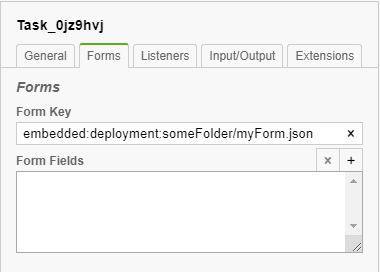

# ART-BPMS-REST

ART-BPMS-REST is a module which adds a simple interface for working with Deployments, Processes, Cases and Tasks through a set of [REST endpoints]
and integration of form client for providing intercommunication between [Camunda] platform and this client. Form client provides
form-specific operations: getting forms, validation and so on (see [Form Client]). 

Features:
* Simple interface for working with Deployments, Processes, Cases and Tasks
* Integration of form clients
* Robust Data validation using both java validation and a form client validation
* File uploading/downloading from FileStorage, which can be replaced with custom FileStorage implementations
* Camunda protocols for storing embedded forms [User Task Forms] 
* Logging 
* Caching (forms, decisions etc.)
* Default implementation of Message Correlation and Signal services

>Note:
>ART-BPMS-REST has its own implementation of [Form Client] called [FormioClient]. Given document assumes use of this implementation and
>[Formio Builder] application for designing forms. But you can use your own implementation and a way to build forms.

---
* [Architecture Overview](#architecture-overview)
* [Security](#security)
* [Environment Installation](#environment-installation)
    * [Docker](#docker)
        * [Full installation](#full-installation)
        * [Partial installation](#partial-installation)
    * [Manual](#manual)
        * [Requirements](#requirements)
        * [Installation](#installation)
    * [ART-BPMS-REST environment resources](#art-bpms-rest-environment-resources)
* [Application Download](#application-download)
* [Application Deploy](#application-deploy)
    * [WAR module](#war-module)
    * [EAR module](#ear-module)
* [Usage](#usage)
    * [How To Work With Forms](#how-to-work-with-forms)
    * [Validation](#validation)
    * [Mapping submitted data to Java Classes](#mapping-submitted-data-to-java-classes)
   * [Steps to create and use forms in BPMN](#steps-to-create-and-use-forms-in-bpmn)
   * [Form Client](#form-client)
   * [File storage](#file-storage)
   * [Bpms-rest SPA example](#bpms-rest-spa-example)
---

## Architecture Overview


## Security

Application REST API is based on JAX-RS with EJB technology. The application specifies that users having the given roles are allowed access to REST API in declarative way. Authentication must be implemented in an application server in a vendor specific way according to an identity management solution. REST endpoints are secured as follows:
* A user accessing REST endpoints must be authenticated
* A user accessing Deployment REST endpoints must have role `BPMSAdmin`
* A user accessing other REST endpoints can have any roles
* A user without roles won't be able to start any process or complete any task

The application also provides access to BMN tasks according to user roles (groups) as follows:
* If a Task or a Process has no Candidate Starter Groups and no Candidate Started Users, then it cannot be started or completed by a user and can only be started programmatically
* If a Task or a Process has Candidate Starter Groups, then only users which has these roles will be able to start/complete the task or process
* If a Task or a Process has Candidate Started Users, then only users with corresponding usernames will be able to start/complete the task or process.

The Identity Service provides user info including user roles. **NOTE! Current version of the application implements Identity Service for Keycloak identity management solution. Therefore Keycloak is used for REST security.**

## Environment Installation


ART-BPMS-REST environment includes Wildfly, Relational Database, Keycloak and Camunda Cockpit tool. You can either install
the environment fully or partially selecting particular components you need.  

### Docker

#### Full installation

1. Clone this repository `git clone http://github.com/Artezio/ART-BPMS-REST.git`
2. Open console and go to `ART_BPMS_REST_HOME_DIR/docker`
3. To change default values of docker variables edit `.env` file. See [Docker variables](/doc/docker-variables.md) for full description of the variables
4. Run `docker-compose up`

Urls of all resources described on [ART-BPMS-REST Environment Resources](#art-bpms-rest-environment-resources) table.

#### Partial installation

Each appllication of the environment  (`bpms-rest`, `keycloak`, `cockpit`) has its own `Dockerfile`, therefore you can run the components separately:

1. Open console and go to `ART_BPMS_REST_HOME_DIR/docker/APPLICATION_DIR`
2. Run 
    ```
    docker build --build-arg {arg_name=arg_val} --tag {name:tag} .
    docker run -it -p {host_app_port}:{container_app_port} {container}
    ```

For more information about `build` and `run` commands see [Docker CLI Run] and [Docker CLI Build]. <br/>

>**Note:**
>`cockpit` runs along with other camunda apps (Tasklist, Admin), hence it has more environment variables than described in `.env` file.
>If you run `cockpit` separately, check [Camunda BPM Platform] for an actual list of the environment variables.

>**Note:**
>If you run `cockpit` for the first time, you are asked for creating a new admin user.

Urls of all resources described on [ART-BPMS-REST Environment Resources](#art-bpms-rest-environment-resources) table.

### Manual

#### Requirements

1. Java 8 or greater

1. Wildfly Server 17.0.1.Final.

1. Relational Database Server.

1. Keycloak Server 7.0.1.Final and corresponding Keycloak Client Adapter.

**Note:**This requirement is for the case of using the default implementation of [Form Client].
1. NodeJs v12.4.1

#### Installation

1. Java. Download [Java] and install it.

1. Wildfly Application server. Download [Wildfly] and unpack it. **NOTE! You could use another JavaEE8-approved server, but there are no guarantees on its workability.**

1. Since ART-BPMS-REST is based on Camunda Procces Engine 7.10 it requires to use the database supported by this version of Camunda Process Engine.
   See [Supported Database Produces] page for relevant list of supported databases. Install downloaded database product and create an empty database.

1. Keycloak Server. Download [Keycloak Server] and unpack it.

1. Keycloak Client Adapter. Download [Keycloak Client Adapter] for Wildfly 17. Unpack the Keycloak Adapter archive to the WildFly home directory.
   To configure the adapter execute:

      Linux/Unix:
      ```shell script
      cd WILDFLY_HOME_DIR/bin
      ./bin/jboss-cli.sh --file=bin/adapter-install-offline.cli
      ```
      
      Windows:
      ```cmd
      cd WILDFLY_HOME_DIR/bin
      jboss-cli.bat --file=adapter-install-offline.cli
      ```
      **NOTE! Don’t use WildFly Elytron Security because it has some issues with Keycloak adapter and EJB security.**

1. Keycloak profile. Add secure-deployment description for ART-BPMS-REST application in accordance to [Configuring the Keycloak Subsystem].

1. JDBC driver deployment. Deploy JDBC driver according to the database on WildFly.

1. Datasource profile. Add datasource with jndi name `java:/datasources/CamundaDS` which will be used by Camunda engine. Set datasource options according to database and JDBC driver.

1. Check out [Formio Client] for information about installation nodejs.

Urls of all resources described on [ART-BPMS-REST Environment Resources](#art-bpms-rest-environment-resources) table.

### ART-BPMS-REST environment resources
|Description|URL|Credentials|
|-----------|---|-----------|
|WildFly application server|http://localhost:8080||
|WildFly management console|http://localhost:9990/console/index.html|admin:admin|
|WildFly remote socket debugging|http://localhost:8787||
|Cockpit|http://localhost:8280/camunda/app/cockpit/default/#/dashboard|demo:demo|
|Keycloak server|http://localhost:8180||
|Keycloak administration console|http://localhost:8180/auth/admin/|admin:password|
|ART-BPMS-REST application*|http://localhost:8080/bpms-rest||
|ART-BPMS-REST API documentation*|http://localhost:8080/bpms-rest/swagger-ui.html|bpmsadmin:1|
|ART-BPMS-REST SPA application**|http://localhost:8080/bpms-rest-spa||

\* — it will be available when ART-BPMS-REST is deployed (see [Deploy section](#application-deploy))
\** - it will be availble when ART-BPMS-REST SPA application is deployed
>**Note**: Table contains paths with default environment variables values.

## Application Download
1 . Download ART-BPMS-REST from this repository and package it:
   ```
   git clone http://github.com/Artezio/ART-BPMS-REST.git
   cd ART-BPMS-REST
   mvn install
   ```   
2. The artifact will be in `ART_BPMS_REST_HOME_DIR\bpms-rest\target\`

## Application Deploy

### WAR module

ART-BPMS-REST application can be used as a standalone web application.

1. Download the application. See [Application Download](#application-download) section.
2. Deploy it on the server
3. Open [bpms-rest app] for REST API description

### EAR module

ART-BPMS-REST application can be included into another application as a part of ear archive.

1. Download the application. See [Application Download](#application-download) section.
2. Add the module to your EAR project's POM
    ```xml
    <dependencyManagement>
        <dependencies>
            <dependency>
                <groupId>com.artezio.bpm</groupId>
                <artifactId>bpm-bom</artifactId>
                <version>1.0</version>
                <scope>import</scope>
                <type>pom</type>
            </dependency>
        </dependencies>
    </dependencyManagement>
    
    <dependencies>
        <dependency>
            <artifactId>bpms-rest</artifactId>
            <packaging>war</packaging>
        </dependency>
    </dependencies>
    ```
3. Declare bpms-rest as web module of your EAR deployment

    > EAR application.xml
    > ```xml
    > <module>
    >   <web>
    >     <web-uri>bpms-rest.war</web-uri>
    >     <context-root>/bpms-rest</context-root>
    >   </web>
    > </module>
    > ```
4. Deploy `.ear` archive on the server
5. Open [bpms-rest app] for REST API description

## Usage

### How To Work With Forms

Forms for [FormioClient] are designed using [Formio Builder]. But you can build forms in any appropriate way regardless of using [FormioClient] or another client.
To point [Camunda] to a form you have to specify `formKey` on a diagram in a corresponding element.  

Example:<br/>



To add forms to a process archive you have to add them along with another the archive's resources, after that these forms becomes visible to ART-BPMS-REST
so they will be automatically deployed with the archive's resources such as BPMN diagrams.

Overall, the workflow looks like this:
1. Build forms
1. Either add `formKey` to `Start Event` or BPMN User Tasks with `formKey` pointing to constructed forms
1. Deploy process with forms into Camunda
1. Start the process using the BPMS-REST by either submitting a start form or starting the process without the start form
1. Request and submit task forms using BPMS-REST

### Validation

On every submit, form data is validated several times:
1. Before submitting, all data gets validated using constraints, if defined
1. After submitting, the data is sent to form client to perform dry cleanup and validation (i.e. all extra submitted data which was not present in the form will be removed)
1. After dry validation all Java Objects which have `javax.validation` constraints are validated using JavaBeans Validation service

### Mapping submitted data to Java classes

When the data is submitted from a form to [Camunda], it's unknown to which Java class json object corresponds, so all objects are stored as Maps in Process Variables.
It is more convenient to contain variables as java classes because in this occasion you can use advantages of java classes. For example if a class is marked
by [JSR 303] annotations, the class is passing bean validation.

To convert the submitted objects to Java classes, Process Extensions are used to define mapping between Process Variable and class which should be used for that variable.

To add class mapping for a process variable, add a Process Extension with name `entity.<variable_name>` and value of the required class:


In the picture above, two mappings are created: between process variable `userInfo` and java class `com.artezio.bpm.model.UserInfo`, between process variable `ticket` and java class `com.artezio.bpm.model.Ticket`

Let's assume the following data is submitted with Process Extensions set as in the picture above:

```json
    {
        "data": {
            "userInfo": {
                "firstName": "John",
                ...
            },
            "marriageInfo": {
                ...
            }, 
            ...
        }
    }
```

Process variable `userInfo` will be stored as class `com.artezio.bpm.model.UserInfo`, and process variable `marriageInfo` will be stored as `Map`.

### Steps to create and use forms in BPMN

1. Create a form using [Formio Builder]
   
1. Depending on how you make a deployment choose one of the following ways:

    * In a Process Application Archive:
    
        1. Put created forms to `/src/main/resources/` directory
        1. Make forms visible to Camunda resource scanner. `processes.xml` file is used for resources declaration. 
            There are two ways to register forms in `processes.xml`:
            * List each form in `process-archive` - `<resource/>` elements
                ```xml
                <process-archive ...>
                    <resource>/forms/form1</resource>
                    <resource>/forms/form2</resource>
                    ...
                </process-archive>
                ```
            * Automatically scan for all forms with specified prefixes
                ```xml
                <process-archive ...>
                    <properties>
                        <property name="resourceRootPath>/forms/</property>
                        <property name="additionalResourceSuffixes">json</property>
                        ...
                    </properties>
                    ...
                </process-archive>   
                ```
           This tells camunda engine to include all resources found in a given path (including subdirectories) and ending with any of enlisted suffixes.
           For more information about how to add resources to a deployment see [Process Archive].
        1. Build the Process Application archive and deploy
         
    * Using REST API:
        
        To make a deployment through REST API you have to make [Create deployment] request. Add all 
        forms into request body along with BPMN diagrams and other resources. Resources in the deployment will have the same name as a
        `name` attribute value in the request.

1. Get task form:
    
    Make [Load form] request. In a result of the request you will get the form definition in `json` view. Use any of numerous [Formio players] to
    depict and work with forms on a client side.

### Form Client

`com.artezio.forms.FormClient` is an interface involving methods to work with forms. To provide your own implementation of 
this interface you have to implement the following methods:

* `getFormWithData(String deploymentId, String formPath, ObjectNode taskVariables)`
   Basing on `deploymentId` and `formPath` returns a correspondent form filled up with data which is already in a process.
   Form format and storage is up to your implementation. `taskVariables` are passed to give information about current variables in a process.

* `dryValidationAndCleanup(String deploymentId, String formPath, ObjectNode submittedVariables, ObjectNode taskVariables)` 
   Perform validation and cleanup of `submittedVariables` against a form which can be got using `deploymentId` and `formPath`.
   The difference between validation and cleanup is that the validation checks up whether variable values are correct or not regarding to
   the form fields while cleanup just removes variables which don't correspond to the form fields. `taskVariables` are passed
   to give information about existing variables in a process. It is useful in a case when the process has readonly variables
   and they must not be overwritten. 

* `shouldProcessSubmission(String deploymentId, String formPath, String submissionState)`
   This method is intended for making a decision if a process should be canceled or not. If the process continues, everything goes by a normal flow
   with validations, submission and so on. If the process is cancelled, there will not be validation and submission, hence submitted variables will not
   get into the process. `submissionState` value is submitted with other form fields and has to be placed in `state` variable.
   A place of the decision returned in accordance to `submissionState` is up to your implementation.
  
* `getFormVariableNames(String deploymentId, String formPath)`
   Returns form field names. Form field name list should contains fields with payload.

To include your implementation into ART-BPMS-REST just add it as a dependency in `bpms-rest/pom.xml` instead of `com.artezio.camunda:formio`.


### File Storage
By default all files are encoded in Base64 and stored in Camunda database as base64 data urls ([RFC 2397](https://tools.ietf.org/html/rfc2397)). 
It's possible to add a custom FileStorage implementation to store files anywhere else, including filesystem, external FTP server, etc. It could be done by implementing 
`com.artezio.bpm.services.integration.FileStorage` interface and making it a CDI bean visible to BPMS-REST module. Only one such implementation is allowed on the classpath. 

When a file gets deserialized into Camunda's engine, FileStorage implementation will be called to store the file. 
When a file gets serialized from Camunda's engine, FileStorage implementation will be called to retrieve the file.

### Bpms-rest SPA example

As bpms-rest consists of REST services it is often convenient to use front-end applications to communicate with bpms-rest services. ART-BPMS-REST
module contains such an application in the form of SPA application. Step to get the application:
1. Go to `ART_BPMS_REST_HOME_DIR/bpms-rest-spa-example`
2. Run `mvn package`
3. Deploy `target/bpms-rest-spa.war` to your web server

To check that it works see [ART-BPMS-REST environment resources](#art-bpms-rest-environment-resources) for an url to the application. 

[Art Mvn Repository]: https://github.com/Artezio/ART-MVN-REPO/packages/109083/versions
[Camunda]: https://camunda.com/
[Configuring the Keycloak Subsystem]: https://www.keycloak.org/docs/7.0/getting_started/index.html#configuring-the-subsystem
[Create deployment]: /doc/deployment-service-api-docs.md#create
[Form Client]: #form-client
[FormioClient]: https://github.com/Artezio/camunda-formio
[Form.io]: https://www.form.io/
[Formio Builder]: https://github.com/Artezio/FormIO-editor
[Load form]: /doc/task-service-api-docs.md#load-form
[Formio players]: https://help.form.io/developer/frameworks
[Java]: https://www.oracle.com/technetwork/java/javase/downloads/index.html
[Keycloak Server]: https://www.keycloak.org/archive/downloads-7.0.1.html
[Keycloak Client Adapter]: https://www.keycloak.org/archive/downloads-7.0.1.html
[Supported Database Produces]: https://docs.camunda.org/manual/7.10/introduction/supported-environments/#supported-database-products
[Process Archive]: https://docs.camunda.org/manual/7.10/reference/deployment-descriptors/tags/process-archive/
[Java]: https://java.com
[JSR 303]: https://beanvalidation.org/1.0/spec/
[Maven]: https://maven.apache.org/
[Git]: https://git-scm.com/
[Keycloak]: https://www.keycloak.org/
[NodeJs]: https://nodejs.org
[Wildfly]: https://wildfly.org/downloads/
[Docker CLI Run]: https://docs.docker.com/engine/reference/commandline/run/
[Docker CLI Build]: https://docs.docker.com/engine/reference/commandline/build/
[Camunda BPM Platform]: https://github.com/camunda/docker-camunda-bpm-platform#camunda-bpm-platform-docker-images
[REST endpoints]: /doc/rest-api-docs.md
[User Task Forms]: https://docs.camunda.org/manual/7.10/user-guide/task-forms/#embedded-task-forms
[bpms-rest app]: http://localhost:8080/bpms-rest
[keycloak app]: http://localhost:8180/auth
