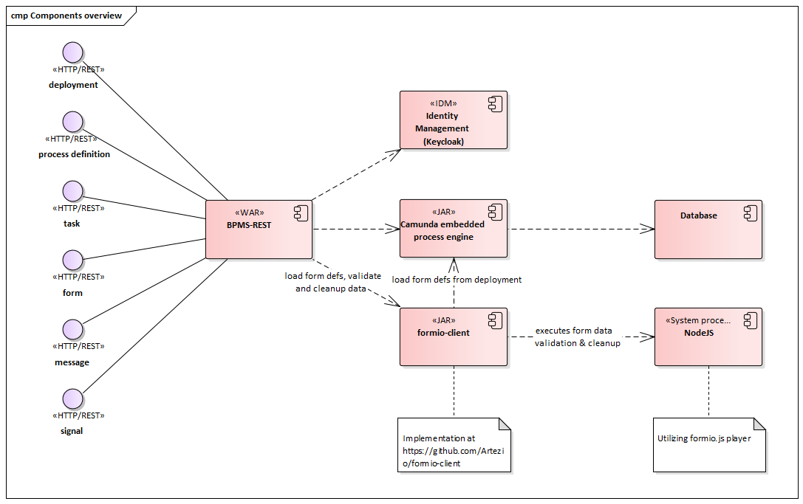

# ART-BPMS-REST

ART-BPMS-REST is a module which adds [Form.io] forms support to [Camunda BPM] engine, as well as some other useful features. 
It provides a set of [REST endpoints] for working with Deployments, Processes and Tasks. 
Forms are designed using Form.io node.js application, stored in Camunda deployments and then could be displayed using any of Form.io form players.

Features:
* Simple integration of User tasks and forms: task form keys are direct references to Form.io forms
* Robust Data validation using both Form.io and java validation
* File uploading from Form.io to Camunda, which can be customized or externalized by providing custom FileStorage implementations 
* Forms versioning
* Logging 
* Form cache
* Default implementation of Message Correlation and Signal services

ART-BPMS-REST uses Form.io node.js servers for storing and validating user forms. Two Form.io servers are required to use this module — Development server and Work server. The development server is used by forms designers for constructing forms. These forms are then downloaded using [formio-import-export-tool](https://github.com/artezio/) and deployed to Camunda along with BPMN diagrams. When the deployment is made, these forms are automatically versioned and uploaded to the work server. ART-BPMS-REST then uses the work server to load forms and validate submitted data.

---
* [Architecture Overview](#architecture-overview)
* [Security](#security)
* [Installation](#installation)
    * [Full Distribution ART-BPMS-REST + Keycloak + Form.io with Docker Compose](#full-distribution-art-bpms-rest--keycloak--formio-with-docker-compose)
    * [Standalone Web application](#standalone-web-application)
    * [EAR module](#ear-module)
    * [Configuration](#configuration)
* [Usage](#usage)
    * [Working with forms](#working-with-forms)
    * [Form versioning](#forms-versioning)
    * [Validation](#validation)
    * [Mapping submitted data to Java Classes](#mapping-submitted-data-to-java-classes)
    * [Internationalization and Localization](#internationalization-and-localization)
   * [Steps to create and use forms in BPMN](#steps-to-create-and-use-forms-in-bpmn)
   * [Corner cases](#formio-related-corner-cases)
* [File storage](#file-storage)
---

## Architecture Overview


\* — ART-FORMIO-EXT is a plugin for form.io that allows to clean up forms (see [ART-FORMIO-EXT Github repository](https://github.com/Artezio/ART-FORMIO-EXT))
## Security

Application REST API is based on JAX-RS with EJB technology. The application specifies that users having the given roles are allowed access to REST API in declarative way. Authentication must be implemented in an application server in a vendor specific way according to an identity management solution. REST endpoints are secured as follows:
* A user accessing REST endpoints must be authenticated
* A user accessing Deployment REST endpoints must have role `BPMSAdmin`
* A user accessing other REST endpoints can have any roles
* A user without roles won't be able to start any process or complete any task

The application also provides access to BMN tasks according to user roles (groups) as follows:
* If a Task or a Process has no Candidate Starter Groups and no Candidate Started Users, then it cannot be started or completed by a user and can only be started programmatically
* If a Task or a Process has Candidate Starter Groups, then only users which has these roles will be able to start/complete the task or process
* If a Task or a Process has Candidate Started Users, then only users with corresponding usernames will be able to start/complete the task or process.

The Identity Service provides user info including user roles. **NOTE! Current version of the application implements Identity Service for Keycloak identity management solution. Therefore Keycloak is used for REST security.**

## Installation

### Full Distribution ART-BPMS-REST + Keycloak + Form.io with Docker Compose

Installation the full distribution with docker compose:
1. Clone this repository `git clone http://github.com/Artezio/ART-BPMS-REST.git`
2. Open console and go to `%ART_BPMS_REST_HOME_DIR%/docker`
3. To change default values of docker variables edit `.env` file. See [Docker variables](/doc/docker-variables.md) for full description of the variables
4. Run `docker-compose up` 

### Partial installation

It is possible to install particular docker container(s) (e.g. ART-BPMS-REST).
1. Open console and go to `%ART_BPMS_REST_HOME_DIR%/docker`
2. Go to any folder you need (`bpms-rest`, `formio`, `keycloak`)
3. Run 
    ```
    docker build .
    docker run -it -p {container_app_port}:{host_app_port} {your_container_id}
    ```

For more information about `build` and `run` commands see [Docker CLI Run] and [Docker CLI Build]. <br/>
>Formio has detached `docker-compose.yml` so you can run `docker-compose up` to run only formio containers (Formio server
> and monogo database). For more information see [Formio Docker].

### Standalone Web application

Installation and configuration guide of ART-BPMS-REST standalone web application using a WildFly application server and Keycloak as example.


#### Environment

1.	Relational Database Server. Since ART-BPMS-REST is based on Camunda Procces Engine supported database is required. See [Camunda documentation](https://docs.camunda.org/manual/7.10/introduction/supported-environments/#supported-database-products) page. For instance, [PostgreSQL database system](https://www.postgresql.org). The DB Server has to contain empty database for Camunda.

1.	Keycloak Server. Keycloak is used for authentication. Download Keycloak Server from the [download page](https://www.keycloak.org/downloads.html) and install according to the [Getting Started Guide](https://www.keycloak.org/docs/latest/getting_started/index.html). Keycloak has to contain realm and client for ART-BPMS-REST application, role `BPMSAdmin` and at lest one user with current role. Also you can use our Docker image with predefined settings (TBD).

1.	Form.io Server. The simplest way of running Form.io server is to run our Form.io Docker image from `/formio` subdirectory. See [Form.io Docker readme](docker/formio/README.MD) to use our Form.io Docker image. To run Form.io without Docker, you would have to:
      - Clone Form.io `v1.59.0` sources from [Form.io Github repository](https://github.com/formio) and install required dependencies listed on their github page
      - Install ART-FORMIO-EXT according to [the install instruction](https://github.com/Artezio/ART-FORMIO-EXT#install-instruction)
      - Configure MongoDB connection settings, install Form.io application with npm and run with nodejs

1.	Java 8 or greater 

#### Installation

1.	Wildfly Application server. [Download](https://wildfly.org/downloads/) and unpack Wildfly 17 Java EE Full & Web Distribution archive. **NOTE! You could use another JavaEE8-approved server, but there are no guarantees on its workability.**

1.	Keycloak adapter. [Download](https://www.keycloak.org/downloads.html) Keycloak Client Adapter for Wildfly. Unpack the keycloak adapter archive to the WildFly home directory. To configure the adapter execute: 
      ```
      $ ./bin/jboss-cli.sh --file=bin/adapter-install-offline.cli
      ```
      **NOTE! Don’t use WildFly Elytron Security because it has some issues with Keycloak adapter and EJB security.**

1.	Keycloak profile. Add secure-deployment description for ART-BPMS-REST application in Keycloak profile in Wildfly configuration file standalone.xml:
      ```xml
      <subsystem xmlns="urn:jboss:domain:keycloak:1.1">
          <secure-deployment name="bpms-rest.war">
              <realm>art-bpms</realm>
              <resource>bpms-rest</resource>
              <auth-server-url>http://localhost:32773/auth</auth-server-url>
              <ssl-required>EXTERNAL</ssl-required>
              <principal-attribute>preferred_username</principal-attribute>
          </secure-deployment>
      </subsystem>
      ```
      Description of configuration options: 

      `name` attribute of `secure-deployment` — identifies the WAR of the ART-BPMS-REST application. Its value is the module-name defined in web.xml with .war appended. Default value is bpms-rest.war;

      `realm` — name of the realm defined on the Keycloak server for the ART-BPMS-REST application;

      `resource` — the client-id in the realm of ART-BPMS-REST application that is used to identify the application;

      `auth-server-url` — the base URL of the Keycloak server. It’s usually of the form https://host:port/auth;

      `ssl-required` — ensures that all communication to and from the Keycloak server is over HTTPS. The external meaning that HTTPS is required by default for external requests;

      `principal-attribute` — OpenID Connect ID Token attribute to populate the UserPrincipal name with. For instance, `preferred_username` token attribute.

      See [Keycloak documentation](https://www.keycloak.org/docs/latest/securing_apps/index.html#_java_adapter_config) for more details.

1.	JDBC driver deployment. Deploy JDBC driver according to database on WildFly. For instance, [driver for PostgreSQL](https://jdbc.postgresql.org/).

1.	Datasource profile. Add datasource with jndi name `java:/datasources/CamundaDS` which will be used by Camunda engine. Set datasource options according to database and JDBC driver. For instance:
      ```xml
      <datasource jndi-name="java:/datasources/CamundaDS" pool-name="bpms-rest-datasource" enabled="true" use-ccm="true">
         <connection-url>jdbc:postgresql://localhost:5432/art-bpms</connection-url>
         <driver>postgresql</driver>
         <new-connection-sql>SELECT 1</new-connection-sql>
         <transaction-isolation>TRANSACTION_READ_COMMITTED</transaction-isolation>
         <pool>
            <initial-pool-size>10</initial-pool-size>
            <max-pool-size>50</max-pool-size>
         </pool>
         <security>
            <user-name>user</user-name>
            <password>password</password>
         </security>
         <validation>
            <valid-connection-checker class-name="org.jboss.jca.adapters.jdbc.extensions.postgres.PostgreSQLValidConnectionChecker"/>
            <check-valid-connection-sql>SELECT 1</check-valid-connection-sql>
            <validate-on-match>true</validate-on-match>
            <background-validation>true</background-validation>
            <exception-sorter class-name="org.jboss.jca.adapters.jdbc.extensions.postgres.PostgreSQLExceptionSorter"/>
          </validation>
          <timeout>
            <idle-timeout-minutes>5</idle-timeout-minutes>
            <allocation-retry>100</allocation-retry>
            <allocation-retry-wait-millis>20000</allocation-retry-wait-millis>
          </timeout>
      </datasource>
      ```

1.	Download ART-BPMS-REST project from git repository and build with maven: 
      ```
      mvn clean package
      ```

1.	ART-BPMS-REST deployment. Deploy bpms-rest\target\bpms-rest.war on WildFly.

1.	Pass configuration options to the server as described in [Configuration](#configuration) section. Restart WildFly and follow the link <host>/bpms-rest/swagger-ui.html for REST API description.


### EAR module

1. Build ART-BPMS-REST war archive

    ```
    git clone https://github.com/Artezio/ART-BPMS-REST.git
    cd ART-BPMS-REST
    mvn install
    ```

1. Add the module to your EAR project's POM

    ```xml
    <dependencyManagement>
        <dependencies>
            <dependency>
                <groupId>com.artezio.bpm</groupId>
                <artifactId>bpm-bom</artifactId>
                <version>1.0</version>
                <scope>import</scope>
                <type>pom</type>
            </dependency>
        </dependencies>
    </dependencyManagement>
    
    <dependencies>
        <dependency>
            <artifactId>bpms-rest</artifactId>
            <packaging>war</packaging>
        </dependency>
    </dependencies>
    ```

1. Declare bpms-rest as web module of your EAR deployment

    > EAR application.xml
    > ```xml
    > <module>
    >   <web>
    >     <web-uri>bpms-rest.war</web-uri>
    >     <context-root>/bpms-rest</context-root>
    >   </web>
    > </module>
    > ```

1. Run Form.io server as described in [Running Form.io server](#running-formio-server) section

1. Start Wildfly server. Pass configuration options to the server as described in [Configuration](#configuration) section  

1. Using wildfly CLI (http://localhost:9990), Add the relational database datasource with jndi name `java:/datasources/CamundaDS` which will be used by Camunda engine

1. Install JAAS Security provider for `bpms-rest.war` deployment ([details](#security))

1. Bundle process application JARs inside your EAR deployment or skip this step to deploy them later using REST API
 
1. Build EAR archive and deploy it to the server. All Process Application Archive will be automatically deployed along with included forms

1. Follow REST API descriptions at `http://localhost:8080/bpms-rest` to work with BPMS-REST backend

1. Refer to [Working with forms](#working-with-forms) section for details on how to deploy and use forms

1. Use REST API endpoints to deploy and run the processes and forms


### Configuration

ART-BPMS-REST is configured by passing the following properties to the server on startup (as -Dxxx flags, i.e. `-DFORM_VERSIONING=true`):
* `FORM_VERSIONING`: Switches on and off [form versioning](#forms-versioning). `true` by default
* `FORMIO_URL`: Form.io Work Server url. By default `http://localhost:3001`
* `FORMIO_LOGIN`: Login to Form.io Work Server. It's used in communication between ART-BPMS-REST and Form.io server. By default `root@root.root`
* `FORMIO_PASSWORD`: Password to Form.io Work Server. Used in communication between ART-BPMS-REST and Form.io server. By default `root`
* `FORMIO_JWT_EXPIRATION_TIME`: Form.io JWT token expiration time in seconds. By default `240`. This is related to Form.io own authentication mechanism and not to ART-BPMS-REST security configuration

The following environment variables can be set:

* `FILE_STORAGE_URL`: file storage URL for custom file storage implementations. By default, files are stored inside Base64 Data Urls.


## Usage

### Working with forms

ART-BPMS-REST uses two Form.io servers, Development and Working. 

Development server is used by form designers for creating forms. 
Forms are then downloaded from Development server to local filesystem before creating a deployment. By adding downloaded forms into Process Application Archive under resources folder, these forms become visible to ART-BPMS-REST so they will be automatically deployed with Camunda resources such as BPMN diagrams.

Work server is used by ART-BPMS-REST for uploading and storing versioned copies of forms. When a deployment is created and uploaded using ART-BPMS-REST endpoints, all forms' identifiers are modified prior to uploading in such way that they become unique across different deployments. Any forms which were removed from work server will be re-uploaded upon next ART-BPMS-REST statup.

Overall, the workflow looks like this:
1. Construct forms using Development Form.io server
1. Download forms from Development Form.io server using formio-import-export-tool and put forms into Camunda deployment along with other resources, such as BPMN diagrams
1. Set process start form key if necessary
1. Add BPMN User Tasks with form keys pointing to constructed forms
1. Deploy process with forms into Camunda
1. Start the process using the BPMS-REST by either submitting a start form or starting the process without the start form
1. Request and submit task forms using BPMS-REST
1. If a form requires updating and the form versioning is enabled, make changes to the form, download the form with formio-import-export-tool and make a deployment with the updated form. Processes started from this point will use the updated version of the form.

### Forms versioning

Form versioning is controlled by property `FORM_VERSIONING`, which accepts values `true` and `false` and is enabled by default

When a deployment is made with form versioning enabled, its forms are given unique deployment-specific suffixes to keep them unique across different deployment versions. In this case, if the form was updated and deployed, its new version is uploaded to Work server, so older versions of this form aren't affected and running processes which use the old version of the form will continue to function without errors.

If form versioning is disabled then forms are uploaded to Work server as is, without identifier modifications. In this case, a form will only be uploaded once and will never be updated, and all deployments will be referencing the same form. If there are multiple forms with the same path, then there's no guarantees on which of them will be deployed and used by the rest of deployments. In this case, processes which use newer versions of the form might function with errors.

### Validation

On every submit, form data is validated several times:
1. Before submitting, inside Form.io player all data gets validated using constraints defined in form designer
1. After submitting, the data is sent to Form.io Work server to perform dry cleanup and validation (i.e. all extra submitted data which was not present in the form will be removed)
1. After dry validation all Java Objects which have `javax.validation` constraints are validated using JavaBeans Validation service

### Mapping submitted data to Java classes

When the data is submitted from Form.io to Camunda, it's unknown which json object corresponds to which Java class, so all objects are stored as Maps in Process Variables.

To convert the submitted objects to Java classes, Process Extensions are used to define mapping between Process Variable and class which should be used for that variable.

To add class mapping for a process variable, add a Process Extension with name `entity.<variable_name>` and value of the required class:


In the picture above, two mappings are created: between process variable `userInfo` and java class `com.artezio.bpm.model.UserInfo`, between process variable `ticket` and java class `com.artezio.bpm.model.Ticket`

Let's assume the following data is submitted with Process Extensions set as in the picture above:

```json
    {
        "data": {
            "userInfo": {
                "firstName": "John",
                ...
            },
            "marriageInfo": {
                ...
            }, 
            ...
        }
    }
```

Process variable `userInfo` will be stored as class `com.artezio.bpm.model.UserInfo`, and process variable `marriageInfo` will be stored as `Map`

### Internationalization and localization

With ART-BPMS-REST it is possible to ship deployment with process (or case) specific l10n resources which can be fetched and used later.
Here is an explanation of how ART-BPMS-REST chooses language-related resources:

1. With process definition (or case definition) id also language range preferences are provided. Language range preferences
consist of language ranges which are RFC standardized set of language tags having info about country, language, locale and so on.
(For more info about language tags and language ranges see [RFC 5646] and [RFC 4647])
2. Basing on provided language ranges ART-BPMS-REST does the following:
    * tries to find a resource with name formed of the filename of the diagram without extension and language range
    (the rule of forming of the resource name is [below](#forming-of-the-resource-name)):
        * if the resource is found, the next language range is processed
        * if the resource is not found, ART-BPMS-REST tries to find the most appropriate resource basing on the rule:
          *sequentially cut off the underscore-separated parts of the wished resource name until they run out*
    * if at the end no resource is found, empty `java.util.ResourceBundle` is returned

#### Forming of the resource name:
The resource name is formed of `i18n/` prefix, the filename of the diagram, which it belongs to, and language tags. The filename and language
tags are separated by underscore (e.g. `i18n/some-file-name_en_Us`). Language tags are also underscore-separated from each other
(e.g. `zh-Hant-HK`) .   
    
#### Example:
Suppose a deployment has resource with name `some-diagram-name_en.properties` and we are passing `en-US` language range.
In accordance with the first step ART-BPMS-REST will try to find the resource with name `some-diagram-name_en_US.properties`.
But the deployment does not have the resource with such a name, so ART-BPMS-REST will remove 'US' part from `some-diagram-name_en_US.properties`
(extension .properties is ignored) and will search `some-diagram-name_en.properties` resource. As the deployment has such
a resource, `java.util.ResourceBundle` with info from this resource will be returned.

**Please Note**: Language ranges are dash-separated, while suffixes in a resource name are underscore-separated.

### Steps to create and use forms in BPMN

1. Log in to Form.io Development server and build a form. Set form path to something meaningful, e.g. `forms/user/personal-information`

    

1. In a BPMN, create User task and set form key to path you just set, prepended by `deployment:`, e.g. `deployment:forms/user/personal-information`. Add candidate users or groups, so the task becomes startable

    
    
    

1. You can also use forms for starting the process. To do this, specify form key with deployment prefix in a Start Event, e.g. `deployment:forms/user/personal-information`

1. Run formio-import-export-tool. Set connection params, credentials and output directory for forms. If you specify any tags, only forms with those tags will be downloaded.   
   > formio-import-export-tool can be executed in GUI mode or as command-line utility. Start it with -h argument to get command-line mode help
   
   Forms will be downloaded into the specified directory and put into corresponding subdirectories
   
1. Depending on whether you're deploying a Process Application Archive or making deployment through REST API, do the following:
    * In a Process Application Archive:
        1. Put downloaded forms to `/src/main/resources/` directory
        1. Make forms visible to Camunda resource scanner. `processes.xml` file is used for resources declaration. 
            There are two ways to register forms in `processes.xml`:
            * List each form in `process-archive` - `<resource/>` elements
                ```xml
                <process-archive ...>
                    <resource>/forms/form1</resource>
                    <resource>/forms/form2</resource>
                    ...
                </process-archive>
                ```
            * Automatically scan for all forms with specified prefixes
                ```xml
                <process-archive ...>
                    <properties>
                        <property name="resourceRootPath>/forms/</property>
                        <property name="additionalResourceSuffixes">json</property>
                        ...
                    </properties>
                    ...
                </process-archive>   
                ```
           This tells camunda engine to include all resources found in a given path (including subdirectories) and ending with any of enlisted suffixes.
           For more information about how to add resources to a deployment see [Camunda Documentation](https://docs.camunda.org/manual/7.10/reference/deployment-descriptors/tags/process-archive/).
        1. Build the Process Application archive and redeploy
         
    * When deploying using REST API:
        
        Send POST request to `/bpms-rest/api/deployment?name=<deployment_name>` endpoint. 
        * Specify deployment name in the query 
        * Add all forms into request body along with BPMN diagrams and other resources
        * Set each form `filename` to be the same as form `path` you set in Form.io editor

1. Get task form:
    * Task id is required
    * Send GET request to `/bpms-rest/api/task/<task-id>/form`. 
    * The response will include deployed form with populated data fields. The data is filled from process variables, and only fields present on the form will be populated and will be accepted on submit. Data not represented as form's field will be discarded
    * Use any of numerous [Formio players](https://help.form.io/developer/frameworks/) to display and submit the form
    
1. Submit task form:
    * Make Form.io player use endpoint `/bpms-rest/api/task/<taskId>/complete` and call its submit() function.
    * You can submit the data without Form.io players by sending POST request with json which contains submitted data:
        ```json
        {
            "data": {
                "field1": 1.0,
                ...
            }
        }
        ```


### Formio-related corner-cases
* With BPMS-REST it is possible to control evaluation of a bpm process, particularly to continue or cancel it. This decision is applied
basing on `state` and `isSubmittedDataProcessed` properties. 
    * `state` property is **required** and passed with other form data:
      ```json
        {
          "data": {
            "formField": "someValue" 
          },
          "state": "someState"
        }
      ```
      `Button` components with `action` type equal to `Submit` or `Save in state` pass `state` by default. If you use `Button`
       components with another type of `action`, make sure that you pass `state`
    * `isSubmittedDataProcessed` property is a custom property of Form.io [Button Component]. It accepts `true` and `false` values:
        > If different to boolean value is passed, it is interpreted as `false`.
        Form.io `Button` component definition example:
      ```json
        {
          (omitted properties)
      
          "properties": {
            "isSubmittedDataProcessed": false
          }    
        }
         
        ```
* `protected` attribute of a subform included in a parent form is treated as follows. When this attribute is set `true`, all subform fields become disabled. This attribute should be used to make entire subforms read-only
* After submitting all files are converted into Camunda `org.camunda.bpm.engine.variable.value.FileValue`, and their `url` fields are
set to point to file id in the file storage. Default file storage is base64 url. See [File Storage](#file-storage) 
for more information about the storage 

## File Storage
By default all files are encoded in Base64 and stored in Camunda database as base64 data urls ([RFC 2397](https://tools.ietf.org/html/rfc2397)). 
It's possible to add a custom FileStorage implementation to store files anywhere else, including filesystem, external FTP server, etc. It could be done by implementing 
`com.artezio.bpm.services.integration.FileStorage` interface and making it a CDI bean visible to BPMS-REST module. Only one such implementation is allowed on the classpath. 

When a file gets deserialized into Camunda's engine, FileStorage implementation will be called to store the file. 
When a file gets serialized from Camunda's engine, FileStorage implementation will be called to retrieve the file. 

[Camunda BPM]: https://camunda.com/
[Form.io]: https://www.form.io/
[Button Component]: https://help.form.io/userguide/form-components/#button-1
[Java]: https://java.com
[Maven]: https://maven.apache.org/
[Git]: https://git-scm.com/
[Keycloak]: https://www.keycloak.org/
[Wildfly 15]: https://wildfly.org/downloads/
[Docker CLI Run]: https://docs.docker.com/engine/reference/commandline/run/
[Docker CLI Build]: https://docs.docker.com/engine/reference/commandline/build/
[REST endpoints]: /doc/rest-api-docs.md
[Formio Docker]: /docker/formio/README.MD